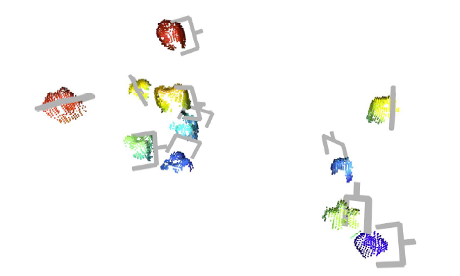
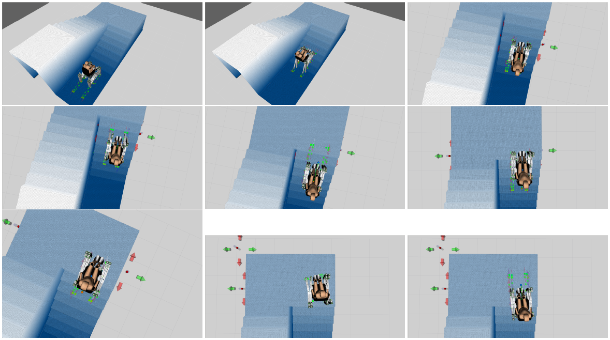
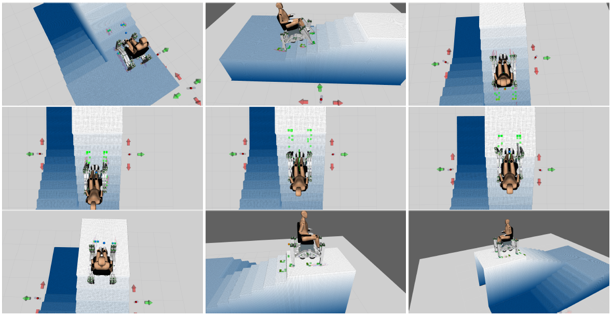

This website hosts visual impressions of most of my past robotics projects, listed in inverse chronological order.

## Master's thesis: Transformer-Based Imitation Learning for Robot Object Manipulation
### Abstract
Despite improving software infrastructure and promising advancements in reinforcement and imitation learning, the challenges in efÏciently automating object manipulation tasks that are simple for humans persist. Thus, in the pursuit of a broadly applicable methodology to reduce the work involved in automating individual processes with robots, I conduct a comprehensive analysis of the capabilities of a state-of-the-art imitation learning method, Action Chunking with Transformers (ACT). This work focuses on ACT due to its notable sample efficiency and success rates in real-world manipulation tasks. Modifications to ACT are also explored, targeting the discovered weaknesses of the model architecture. While most show potential but have inconclusive results, the addition of causal attention to the transformer model, also included in one of the follow-up work's codebases, though highlighted in the corresponding paper, is very beneficial. The general findings suggest that while ACT offers impressive capabilities in imitated dexterity and its sample efÏciency, it requires highly uniform and precise demonstrations and struggles with longer tasks. Additionally, identifying the best-performing models necessitates extensive effort due to the inconsistency between the weights reaching the lowest training and validation losses and those with the best deployment performance. Consequently, ACT, in its current state, only partially meets the goal of reducing the overall workload for the automation of robot object manipulation, though it is a step in the right direction.

Among the experiments I made in this thesis, I iterated on the data collection process. Below are example rollouts from two datasets for the same task, *Align Push*.

#### Align Push Task Mono Dataset:
The second dataset followed a single action mode for each occurring situation combined with less initialization randomization. The achieved full task success rate was 50%:

Successful rollout examples:
<video controls width="100%" height="auto">
  <source src="align_push_mono_successes_2.mp4" type="video/mp4">
  Your browser does not support the video tag.
</video>
<video controls width="100%" height="auto">
  <source src="align_push_mono_successes_3.mp4" type="video/mp4">
  Your browser does not support the video tag.
</video>
<video controls width="100%" height="auto">
  <source src="align_push_mono_successes_5.mp4" type="video/mp4">
  Your browser does not support the video tag.
</video>
<video controls width="100%" height="auto">
  <source src="align_push_mono_successes_7.mp4" type="video/mp4">
  Your browser does not support the video tag.
</video>

#### Align Push Task Multimodal Dataset:
The first dataset contained more multimodal data. It featured heavier randomization and less stringently structured manipulations in demonstrations, showing multiple solutions for similar block arrangements, following the fastest available solution paths for given situations. The best checkpoint achieved a 20% full task success rate:

Successful rollout examples:
<video controls width="100%" height="auto">
  <source src="align_push_multi_successes.mp4" type="video/mp4">
  Your browser does not support the video tag.
</video>

A close call:
<video controls width="100%" height="auto">
  <source src="success_but_barely.mp4" type="video/mp4">
  Your browser does not support the video tag.
</video>

Failure examples:
<video controls width="100%" height="auto">
  <source src="align_push_multi_failures.mp4" type="video/mp4">
  Your browser does not support the video tag.
</video>

________

The following screenshot displays generated grasps on filtered point cloud data of detected sweet peppers from my sweet pepper grasp generation project. It builds on the works of Zaenker et al. https://arxiv.org/abs/2303.03048# and Huang et al. https://arxiv.org/abs/2211.00191 :

________

These are screenshots of my multi-marker-, multi-camera-based occlusion robust object tracking project for self-interlocking building blocks used in an automated assembly project at my university called SL-Blocks. They show the coordinate systems tracked on all surfaces of the building blocks, whether visible or not, in the given situation. Occluded coordinate system poses are calculated through optimization over the reprojection errors between visible markers and the known transformations between all coordinate systems:

  
   

________

## Bachelor's thesis: Continuous Locomotion Planning for an Eight-Legged Robot Using Joystick Control
### Abstract
Enabling legged robots to walk across complex terrain like staircases, construction sites or rough terrain is an active field of research with many different challenges. Manually controlling robots is desirable in many scenarios where the AI-control of the system is insufficient to solve the task at hand by itself. It is an option for commercially successful and research-wise highly relevant robot systems such as the Spot series by Boston Dynamics or the ANYmal robot by ANYmal Research. A common method to perform locomotion using legged robots in complex terrain is footstep planning, a hierarchical control archetype. Here, a suitable step sequence is planned that reaches a commanded goal pose and solves the robot control task assuming the foot placements to be fixed. An evident lack of methodology in the literature regarding manual assisted control for search-based systems such as footstep planning was noted. The contribution of this work is a new generalized approach for extending footstep planning based robot systems with joystick control for manual assisted operations in challenging terrain. It enables intuitive, reactive, and safe continuous locomotion in soft real-time. The construction of the joystick control for footstep planning based systems with these properties is thoroughly discussed. Challenges lie in integrating collision avoidance with the terrain while considering the limitations of the robots, such as the kinematics and the time constraints for continuous walking. Also addressed is how to limit the creativity of the joystick control when reinterpreting inputs for more sensible plans of motion. The developed joystick control is evaluated for the Walkerchair, an eight-legged robotic wheelchair, in realistic scenarios in simulation.

Pictured below is the simulated ascension of stairs with the assisted joystick control developed in this thesis:

